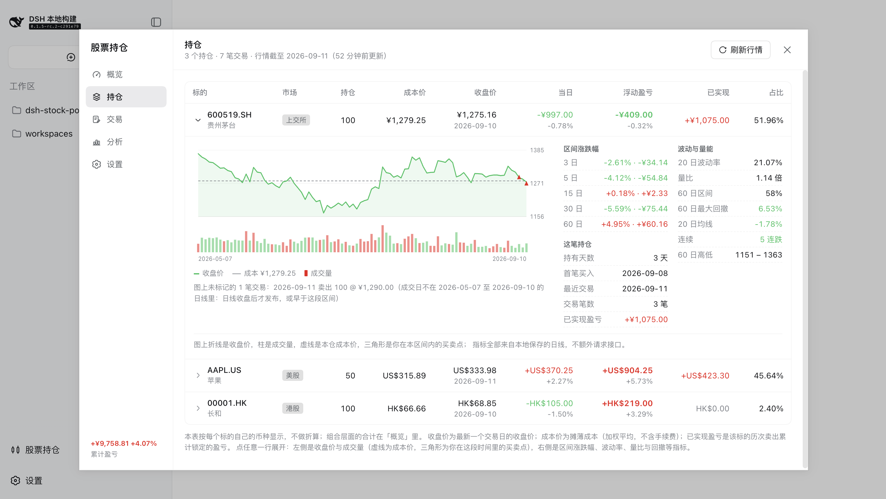
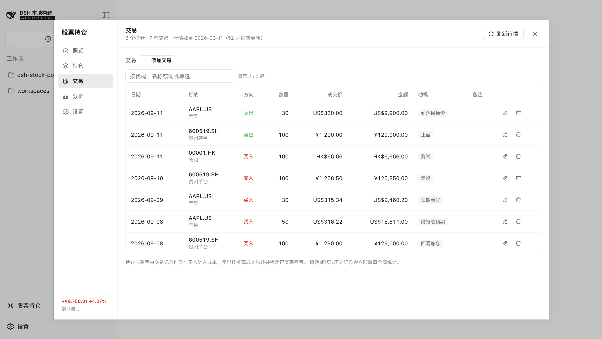
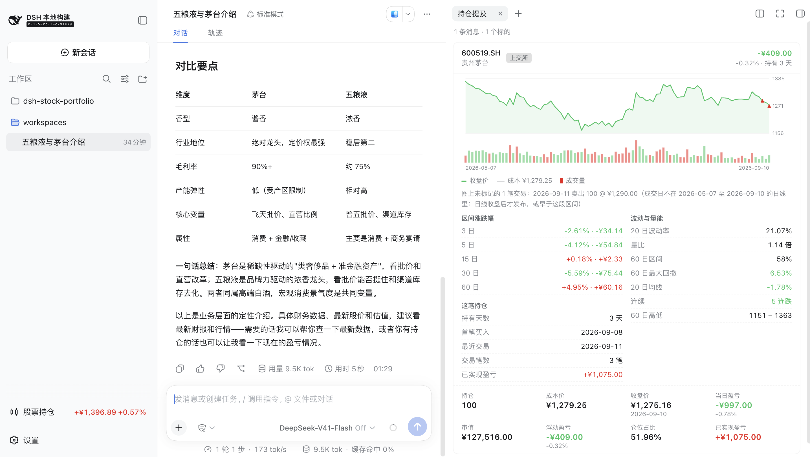

# dsh-stock-portfolio

在 [DeepSeek Harness](https://github.com/deepseek-ai/deepseek-harness)（DSH）里管理股票持仓：交易记录、盈亏统计、按日线保存的行情、离线代码检索与持仓复盘，全部落在本地 SQLite。覆盖 A 股（沪深京）、港股、美股，以及 ETF、指数、可转债。

三个入口，读写同一份数据：

- **侧边栏「股票持仓」**（「设置」上方，右侧直接带当日盈亏）→ 管理面板，五个分区。这一行是唯一不点就可见的东西，数字在插件挂载时就读一次（之后每 5 分钟一次）。
- **对话里读数据、记交易**：说「昨天买了 100 股腾讯」就写入，缺的字段当场弹一张问题卡片问；问「腾讯最近怎么样」「我在哪个动机上赚得多」时直接读本地 SQLite 回答。读持仓、行情与聚合分析不用授权，读**交易记录明细**每次都会先弹一张授权卡片。`
- **对话右侧栏「持仓提及」**：对话里出现持仓标的的代码或名称时自动展开，列出它的走势与持仓统计。

界面只用 DSH 自己的主题变量（`--dsw-alias-*`），自动跟随浅色 / 深色主题。





<sub>截图仅为效果预览，不构成投资建议。</sub>

## 面板

| 分区 | 内容 |
| --- | --- |
| **概览** | 持仓市值、总盈亏、未实现盈亏（带浮盈 / 浮亏家数）、当日盈亏、已实现盈亏、胜率、持仓集中度、平均持有天数；按每日收盘价回溯的市值走势图；市场分布与分币种小计 |
| **持仓** | 数量、成本价、最新收盘价（带日期）、当日盈亏、市值、浮动盈亏、已实现盈亏、仓位占比；表头可排序。**每行可展开**：左边是这只标的的收盘价 + 成交量走势（虚线是成本价、三角形是这段区间里的买卖点），右边是 3/5/15/30/60 日涨跌幅、20 日波动率、量比、60 日区间与最大回撤、均线偏离、连续涨跌，以及持有天数、首笔买入、交易笔数、已实现盈亏。窗口按交易日数（假期不占格子），比手里的日线长就显示「—」而不缩窗口，指标全部由本地日线现算、不额外请求接口。每行按标的自己的币种显示 |
| **交易** | 增 / 改 / 删；表单默认折叠，动机字段旁按方向给出常用速选词，点一下即填入，也可自由输入 |
| **分析** | 已实现盈亏记在**卖出**动机上、浮动盈亏按买入动机的成本占比分摊，另有交易所分布、标的表现排行、清仓历史 |
| **设置** | API Key、基准货币、自动获取的汇率、后台行情检查间隔、会话提及是否展开右侧栏、本地代码索引状态 |

## 对话里提到持仓标的

对话里出现持仓标的的代码或名称时，右侧栏的「持仓提及」自己展开，一个标的一张卡片：**和持仓行展开后同一块细节**（线柱图 + 区间指标），下面接它的持仓统计（成本、现价、当日与浮动盈亏、占比、已实现、持有天数）和组合当前的盈 / 亏家数；已清仓或只有交易记录的照常显示走势与历次交易。换到有提及的会话——**包括历史会话**——会展开，后续的新提及也会；**已经在显示时就只更新内容**，不会把用户收起的右栏重新顶开。自动展开可在「股票持仓 → 设置」里关掉，之后从右侧栏「指引」页的「持仓提及」入口打开。

提及由一个会话投影（`stockPortfolioMentions`）折出：用户输入与助手回复都算，从磁盘恢复的历史会话在首次读取时把整段日志折一遍；浏览器每 2 秒问一次当前会话的状态（页面不可见时不问）。命中规则按歧义分级，因为误报比漏报更烦人：

- 数字代码必须独立成词：`1600519` 里的那一段不算。
- 字母代码四位以上不分大小写（`aapl` 也认），两三位只认大写（否则 `it`、`on`、`all` 会命中 Gartner、ON Semiconductor、Allstate），单字母只认 `F.US` 或名称。
- 名称按子串匹配，ASCII 名称要求词边界（`Applebee` 不会命中 `Apple`）；子代理自己的会话不参与。

## 在 chat 里读数据、记交易

同一个插件还向会话注册六个 Tool，读写同一份 SQLite：

| Tool | 权限 | 回答什么 |
| --- | --- | --- |
| `stock_add_trade` | 直接写入 | 把一句话变成一笔交易记录 |
| `stock_portfolio_overview` | 自动读 | 持仓明细、市值、浮动 / 已实现 / 当日盈亏、分币种小计 |
| `stock_symbol_detail` | 自动读 | 单个标的的本地日线与指标（涨跌幅、均线偏离、波动率、量比、区间、回撤、连续涨跌），外加它的持仓与清仓历史 |
| `stock_analysis` | 自动读 | 按动机、按市场的盈亏分布，标的表现排行，清仓历史与胜率 / 平均盈亏 / 盈亏比 |
| `stock_search_symbols` | 自动读 | 本地代码索引检索（离线、瞬时） |
| `stock_list_trades` | **先问用户同意** | 单笔交易明细：日期、方向、数量、价格、动机、备注 |

读持仓、读行情、读聚合分析都不打断用户；**交易明细是唯一需要授权的读**。`stock_list_trades` 每次调用都会先通过 `ctx.userQuestions` 弹一张卡片问「要读取你的交易记录明细吗？」，卡片上写清这次会读什么（哪个标的、买入还是卖出、哪个时间段、最多多少笔）。点「允许这一次」才返回记录；选「不允许」、把卡片关掉、答非所问，或者当前会话根本没有人类回答者（子代理、没挂 answerer 的组合），拿到的都是一条**不含任何记录**的结果，并附上原本要问的问题，让调用方自己用 `ask_user_question` 再问一次。授权按次生效——不落盘、不记忆，下一次读还会再问。

读的那几个也不猜：`stock_symbol_detail` 遇到有歧义的名字（「银行」命中两只）会在同一次调用里弹卡片让用户挑，子代理问不到人时返回候选列表而不是替用户选一个。读全部走本地 SQLite——日线与指标现算，不额外请求行情接口，离线也能答。

说「昨天买了 100 股腾讯」就够了。**没说的字段不会被猜**：缺什么就在同一次调用里通过 `ctx.userQuestions` 弹一张卡片问什么——标的选项来自本地代码索引，价格首选本地最新收盘价并注明不是你自己的成交价，日期给今天 / 昨天，动机给按方向的速选词——已经说过的不会再问，说全了一张都不弹。写入走 `PortfolioService.addTrade`，和面板保存同一条校验路径；按形状推断的交易所（`002594` → `002594.SZ`）写在返回值的 `notes` 里。子代理没有人类回答者、或组合里没挂 `ctx.userQuestions` 时，Tool 不写入任何东西，而是把还缺的字段和原本要问的问题（含选项）原样返回；六个 Tool 都随插件卸载。

## 口径

- **只按日线。** 每标的每交易日一行，没有分时；估值用最新收盘价，「当日盈亏」对比前一日收盘价，界面上的价格永远带日期。
- **按需取数。** 最新一根已是数据源能给的最后交易日时不发请求，落后的只补缺口（`start_time` = 上次更新次日），几只股票合成一次批量请求；数据源滞后（假期、停更）时记「今天已经问过」的水印。新标的（含 chat 里刚记的）写入时当场取最近 90 天，最多等 2.5 秒，超时先返回、行情在后台继续落地。
- **成本与盈亏不含手续费**：移动加权平均，卖出按摊薄成本结转并锁定已实现盈亏。
- **汇率一天取一次**（`ctx.web.fetch` 优先，失败退回 `ctx.web.search`），基准货币默认人民币，也可在设置页手动覆盖。
- **数据源与代码索引**：不填 Key 也能用（免费端点提供日线），Key 的优先级为设置 > 环境变量 > `.env` > 插件行，设置页只回传「已配置 / 未配置」；全市场约 23,500 条标的抓在本地、每周更新，搜索即时、可离线——写法 `600000.SH` / `00700.HK`（补足五位）/ `AAPL.US`，裸代码按形状推断并显示结果。

## 安装

插件是标准的 DSH **bundle** + **dual-face client**：

```sh
npm install && npm run build
dsh plugin --profile web add ~/codespaces/dsh-stock-portfolio      # 方式一
```

```yaml
# 方式二：profile 的 patch 层直接挂载本地 checkout（name 相对 patch 文件解析）
# ~/.dsh/profiles/web/cordis.patch.yml
- insert:
    - id: stock-portfolio
      name: ../../../codespaces/dsh-stock-portfolio/lib/index.js
```

web profile 是 `patchReload: live`，保存后 Host 半边会重组；浏览器需要刷新一次页面。改完代码不用重启 `dsh`：

```sh
npm run build     # 额外写一份内容寻址的 lib/index.dev.<digest>.js
npm run reload    # 把 profile 的行指向最新 dev 副本 → 触发重载
```

可选配置写在 patch 行里：`dataDir`（默认 `$DSH_HOME/storages/stock-portfolio`）、`apiBase`、`apiKey`。

## 开发

```sh
npm run build      # lib/index.js（Host）+ lib/client.js（浏览器）+ 类型
npm run watch      # 监听 src/ 重建
npm run typecheck  # tsc --noEmit
npm test           # node --test，全部离线
npm run reload     # 让运行中的 dsh 换用刚构建的 Host 半边
```

浏览器半边有三类用例：`client-bundle.test.mjs` 用桩模块表加载 `lib/client.js` 并真正执行 `apply`；`client-render.test.mjs` 用真实 React 渲染各分区；`client-mount.test.mjs` 在 jsdom 里挂载真实组件、让 effect 与请求跑完，断言点开一行之后线柱图与指标确实画了出来。

`npm run reload` 按「写同目录临时文件 → rename 覆盖 → 回读校验」替换 patch，并先确认目标 bundle 存在且非空，所以一次断电不会留下半截 YAML 把 `dsh` 卡在启动阶段。数据目录、`.env` 位置、dev 副本路径都在运行时按 `$DSH_HOME` / `import.meta.url` 推导，仓库里没有硬编码的绝对路径。

## 已知边界

- 会话里能读持仓、行情、聚合分析与交易记录，但只能**新增**交易：改一笔、删一笔仍在面板里做。读交易明细每次都要用户点一次同意，没有明确同意就一条记录也不返回。
- 指数类裸代码有歧义（`000300` 既是沪深 300 的形状、也是深市股票的形状），需要后缀或搜索。
- 批量日线权限因套餐而异；没有权限时刷新会改为逐个代码请求，代码多时更慢。
- 不做汇率的历史回溯：市值走势图用**当前**汇率折算。
- 行情按交易日更新，美股与港股收盘时点不同，面板顶部显示行情的最新日期。

## 开源协议与声明

- **License: MIT** — 见 [`LICENSE`](LICENSE)。
- **行情数据来自 [TickFlow](https://tickflow.org)（`api.tickflow.org` / `free-api.tickflow.org`）。** 本项目是第三方客户端，与 TickFlow 无隶属或合作关系，相关名称与商标归其各自所有者；接口行为可能随时变化。行情数据仅供个人参考，**不构成任何投资建议**，据此操作风险自负。
- **DSH 版本**：在 DSH `0.1.5-rc.2`（本地构建）上开发与验证。浏览器半边通过 shell 冻结的平台模块表解析 `react` / `@deepseek-ai/dsh-client-ui-*`，升级 DSH 后若该表有变动，需同步 `scripts/build.mjs` 里的 externals 列表。
